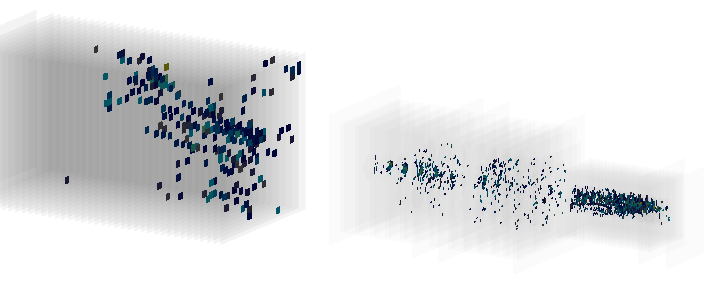
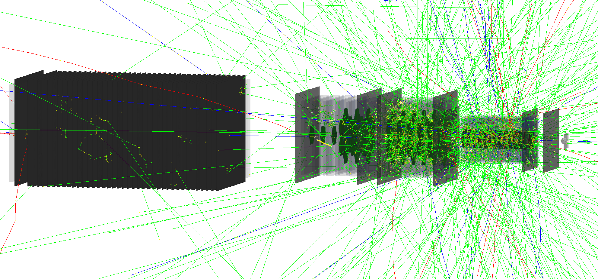

# Geant4 Based Event Display & Standalone Simulation
## HGCal Beam Tests 2017-18

## Scope
This repository contains the source code for two programs, namely one for **event visualisation** and one for **standalone simulation of CMS High Granularity Calorimeter prototypes** as they were tested with paricle beam in 2017-18. The programs are based on libraries and functionalities provided by the **Geant4 framework**.
Implemented geometries are intended to only resemble the prototpye configurations like they were tested in reality. An **accurate correspondence between the real and implemented configuration is not guaranteed**.

## Software requirements
These two programs were developed and are tested with the following software:

* GEANT4 10.4 (mandatory for compilation and execution)
* ROOT 6.14 (mandatory for compilation and execution)
* cmake 3.4 (mandatory for compilation)
* QT5 or OpenGL (recommended, for visualisation of the geometry and the particle showering)

## Event Display

See ```eventDisplay/README.md``` for installation & running instructions.

## Standalone Simulation

See ```simulation/README.md``` for installation & running instructions.

## Implemented Geometries
See ```common/README.md``` for overview on implemented materials and geometries.

## Bugs and Feature Requests
Please use the issue tracking or contact the main developer: thorben.quast@cern.ch
